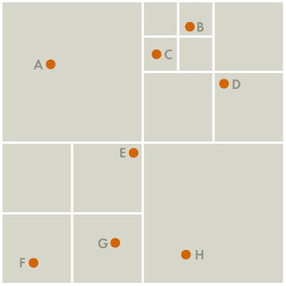
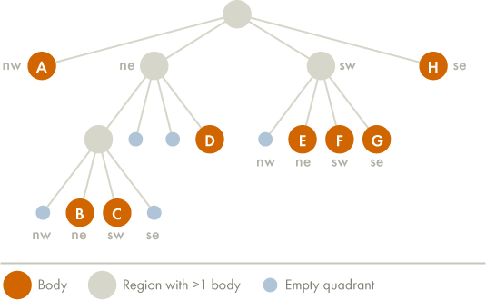

In physics, the $N$-body problem consists of the computation of all pair interactions in a system consisting of $N$ particles. The two best-known cases are gravitational interactions, e.g. between the stars in a galaxy, and electrostatic interactions between atoms represented as point charges. The interactions can be described by a potential energy or by the forces acting on each particle, i.e. the derivatives of the potential energy with respect to the positions. The latter case is practically more relevant in simulation algorithms.

The N-body problem can be formulated as

$$
F_i = \sum_{j \neq i} w_i w_j f(x_i-x_j)
$$

where $x_i$ are the positions of the particles, $F_i=$ is the total force acting on particle $i$, $w_i$ is a parameter describing particle $i$ (i.e. mass or charge), and $f(d_{ij})$ describes the functional form of the interactions, which depend only on the distance vector $d_{ij}$ between two particles.

In the following, we will be interested in simulating a galaxy consisting of many bodies (stars, dusts, planets, ...). These bodies are represented by their position, their velocity and their mass. We use Newton's second law which says that mass times acceleration is equal to the total force on each mass point. The forces are computed using Newton's law of universal gravitation:

$$
F_{ij} = \frac{Gm_im_j(x_j-x_i)}{\left|x_j-x_i\right|^3},
$$

where $m_i$ is the mass and $x_i$ the position of the particle $i$. $\left|x_j-x_i\right|$ is the distance between particles $i$ and $j$.

The acceleration is then given by

$$
m_i\frac{d^2x_i}{dt^2}=\sum_{j\neq i}F_{ij}.
$$

As you can see, we have to solve an ODE. There are several iterative methods to solve this equation numerically. But before we choose one of theses schemes, let's take a look at the computation of the forces.

Suppose that we have $n$ bodies. A naive algorithm to compute the forces is

```cpp
for(std::size_t i = 0; i < n; ++i)
{
    for(std::size_t j = 0; j < n; ++j)
    {
        if (i != j)
        {
            F[i] += G*m[i]*m[j]*(x[j]-x[i])/distance(x[i], x[j])**3
        }
    }
}
```

This algorithm is of complexity $n^2$ !!

It is a really slow algorithm. It is possible to improve the computation of the interactions between particles by using the Barnes-Hut algorithm. The idea is to divide the $n$ bodies recursively into groups according to spatial proximity, by storing them in a quad-tree (for a 2D problem) and to say that if a group of bodies is sufficiently far away from any other bodies, we can approximate its graviationnal effects by using its center of mass. The center of mass of a group of bodies is the average position of a body in that group, weighted by mass. This algorithm is of complexity $n \log n$.

## **Building the tree**

Let's take the example given on this excellent post ([http://arborjs.org/docs/barnes-hut](http://arborjs.org/docs/barnes-hut)). We encourage you to read this article carefully to acquire a deeper understanding of the algorithm.

{ width=50% }


The generated tree is the following

{ width=70% }


The algorithm for the construction of the tree is to insert the bodies one after another. We use a recursive procedure to insert a body $b$ into the tree at node $x$.

   1. if the node $x$ is empty, put the new body $b$ here,
   2. if the node $x$ is a non-empty quadrant, find the right sub-quadrant for body $b$ and apply the procedure recursively substituting this sub-quadrant for $x$,
   3. if the node $x$ is a body $c$, subdivide the region until bodies $b$ and $c$ are in different quadrants. Then, insert bodies $b$ and $c$ in the right quadrants.

## **Calculating the mass and the center of mass**

Now that we have constructed our tree, we can calculate the center of mass and the total mass of the cell using this algorithm

   1. initialize the arrays `total_mass` and `center_of_mass` with size $n_{bodies} + n_{cell}$
   2. store the mass and the coordinates of the bodies at the beginning of the arrays `total_mass` and `center_of_mass`
   3. loop over the cells starting at the end (i.e. the top-level node)
       1. find the elements of the cell
       2. sum the masses of all elements that are bodies or cells
       3. compute `center_of_mass` as the sum of the coordinates multiplied by the mass of each element
       4. normalize `center_of_mass` by `total_mass`

## **Calculating the forces**

To calculate the total force acting on body $b$, we use the following recursive procedure, starting with the root of the quad-tree

   1. If the current node is an external node (and it is not body $b$), calculate the force exerted by the current node on $b$ using Newton's law of universal gravitation, and add this amount to $b$’s total force.
   2. Otherwise, calculate the ratio $\frac{s}{d}$. If $\frac{s}{d} < \theta$, treat this internal node as a single body, and calculate the force it exerts on body $b$ by using the `center_of_mass` for the position and the `total_mass` for the mass using again Newton's law of universal gravitation, and add this amount to $b$’s total force.
   3. Otherwise, run the procedure recursively on each of the current node’s children.

## **Solve the ODE**

Now that we can compute the forces of our system, we can solve the ODE by using an iterative method. Suppose that you want to solve the following ODE

$$
y'(t) = f(t,y).
$$

The Adam Bashforth of order $6$ solves this equation numerically via the formula

$$
y_{k+1} = y_k + \Delta t \left(a_0f(t_{k}, y_{k})+a_1f(t_{k-1}, y_{k-1}) + a_2f(t_{k-2}, y_{k-2})+a_3f(t_{k-3}, y_{k-3})+a_4f(t_{k-4}, y_{k-4})+a_5f(t_{k-5}, y_{k-5})\right)
$$

where

$$
\begin{array}{l}
a_0 = \frac{4277}{1440}, \\\\
a_1 = \frac{-7923}{1440}, \\\\
a_2 = \frac{ 9982}{1440}, \\\\
a_3 = \frac{-7298}{1440}, \\\\
a_4 = \frac{2877}{1440}, \\\\
a_5 = \frac{-475}{1440}.
\end{array}
$$

To initialize this scheme, we will use a Runge Kutta method of order $4$ to calculate the first solution steps.

In the N-body problem, the unknowns are the coordinates and the velocities of the system. Calculating the forces gives us the acceleration of the system. With this acceleration, we can calculate the velocities at the time step $k+1$. The new positions at time step $k+1$ are calculated using the velocities at time step $k, k-1, \dots, k-5$.

## Work to be done

For this project, you have to

- Propose a data structure to store the data and use it in the different algorithms.
- Propose a way to load and store the data (JSON file ([nlohmann](https://json.nlohmann.me/)), ...).
- Propose a python script to visualize the results.
- Try the algorithm on the solar system.

The source code must be well documented and the repository of the project must contain several examples and tests. In the report, you must justify your choices and clearly explain the data structure.
