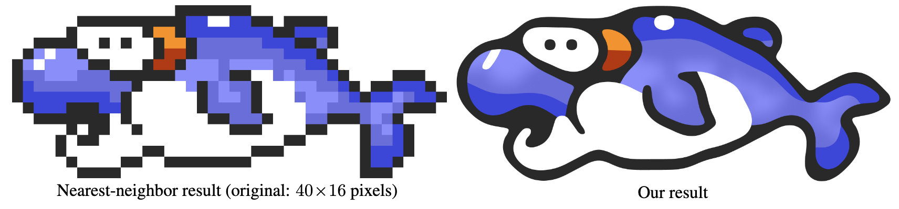

In this project, we are interested in improving the quality of a pixel art image by applying spline methods. This idea was developed in the article [Depixelizing Pixel Art](https://johanneskopf.de/publications/pixelart/paper/pixel.pdf) by J. Kopf and D. Lischinski in 2011.

The figure below illustrates the possibilities of the algorithm

{ width=50% }

## Work to be done

For this project, you have to

- Propose a data structure to store and to manage the data.
- Implement the method described in the paper.
- Use an external library to load and save images (see [OpenCV](https://opencv.org/) for example)
- Apply the algorithm on several pixel arts.

The source code must be well documented and the repository of the project must contain several examples and tests. In the report, you must justify your choices and clearly explain the data structure and the algorithms.