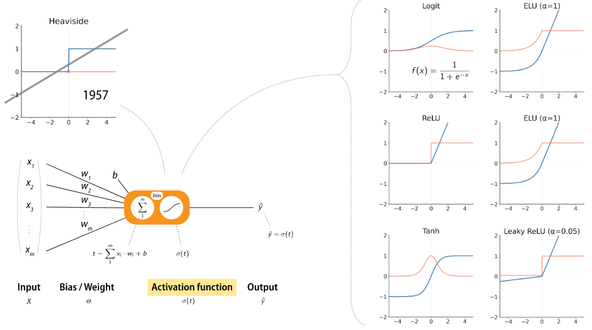
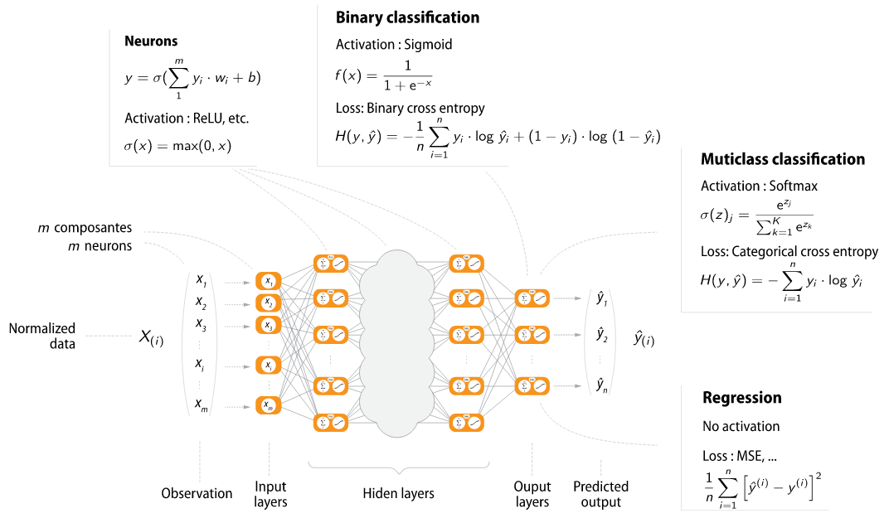

You see a lot of people around you who are interested in deep neural networks and you think that it might be interesting to start thinking about creating a software that is as flexible as possible and allows novice users to test this kind of methods.

We recall here the key elements found in deep neural networks. We will not go into the mathematical details as this is not the purpose of this project.

A deep neural network is composed of an input, an output and several hidden layers.

A neuron is illustrated by the following figure

{ width=90% }

This figure comes from a CNRS course called fiddle (https://gricad-gitlab.univ-grenoble-alpes.fr/talks/fidle).

We can observe that a neuron is made of weights, a bias and an activation function. The activation function can be a sigmoid, reLU, tanh, ...

A deep neural network is composed of several hidden layers with several neurons as illustrated in the following figure

{ width=90% }

This figure also comes from the CNRS course fiddle.

In the following, we will use these notations:

- $w^l_{j,i}$ is the weight of the layer $l$ for the neuron $j$ and the input entry $i$.
- $z^l_j$ is the aggregation: $\sum_i x_{i}^l w_{j, i}^l + b_j^l$ where $x_{i}$ is the input.
- $\sigma$ is the activation function.
- $a^l_j$ is the output of the neuron $j$ for the layer $l$.
- $L$ is the index of the last layer.
- $C(a^L, y)$ is the cost function where $a^L$ is the predict value and $y$ is the expected result.

The algorithm has three steps:

- The forward propagation: for a given input, cross all the layers until the output and fill $z^l$ and $a^l$.
- Change the weights and biases to minimize the cost function using a descent gradient. This is called backward propagation.
- iterate until reaching the maximum number of iterations or a given tolerance.

The gradient descent can be written as

$$
w_{j, i}^l = w_{j, i}^l - \mu \frac{\partial C}{\partial w_{j, i}^l},
$$

where $\mu$ is the learning rate.

The equations of the backward propagation are

- $\delta^L_j = \frac{\partial C}{\partial a_j^L}\sigma'(z_j^L)$
- $\delta^l_j = \sum_i w^{l+1}_{i, j}\delta^{l+1}_i \sigma'(z_j^l)$
- $\frac{\partial C}{\partial b^l_j} = \delta_j^l$
- $\frac{\partial C}{\partial w^l_{j, i}} = a^{l-1}_i \delta_j^l$

We need a set of datas: datas for training the neural network and datas for testing the final weights and biases.

You can find more information on the following links

- [https://gricad-gitlab.univ-grenoble-alpes.fr](https://gricad-gitlab.univ-grenoble-alpes.fr)
- [http://neuralnetworksanddeeplearning.com/index.html](http://neuralnetworksanddeeplearning.com/index.html)

## Work to be done

For this project, you have to

- Propose a flexible and user friendly data structure able to manage several hidden layers and describe for each of them the activation function. A list of cost functions should also be available.
- Propose a way to load data from the website [openML](https://www.openml.org/). You could use for example this [csv parser](https://github.com/vincentlaucsb/csv-parser)
- Experiment your library on at least the two well-known datasets [iris](https://www.openml.org/d/61) and [MNIST](https://www.openml.org/d/554)

The source code must be well documented and the repository of the project must contain several examples and tests. In the report, you must justify your choices and clearly explain the data structure and the algorithms.