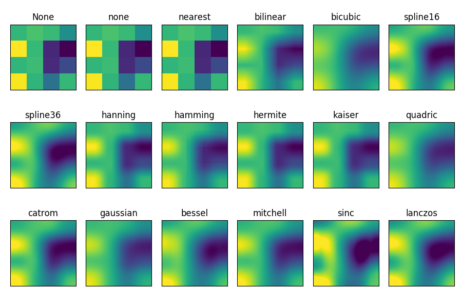

Image interpolation can have many utilities when you manage photos, videos, ... They occur when you want to resize an image, when you want to change the perspective or make a rotation.

In most situations, you will add pixels and compute their value using a numerical method which use neighbors. It can be seen as a convolution kernel applied to the original image.

The image below illustrates the behavior of several interpolation methods on a small image. This experiment is realized using matplotlib (see the [documentation of imshow](https://matplotlib.org/3.1.1/gallery/images_contours_and_fields/interpolation_methods.html))

{ width=60% }

For more details, you can read the article ["Linear Methods for Image Interpolation"](https://www.ipol.im/pub/art/2011/g_lmii/revisions/2011-09-27/g_lmii.html) by Pascal Getreuer in IPOL Journal.

## Work to be done

For this project, you have to

- Use an external library to load and save images (see [OpenCV](https://opencv.org/) for example)
- Propose a data structure to store the image data and use it in the different algorithms
- Implement all the methods found in the article for resizing and rotation
- Compute the quality of the resulting image using for example the root mean squared errors

The source code must be well documented and the repository of the project must contain several examples and tests. In the report, you must justify your choices and clearly explain the data structure and the algorithms.

